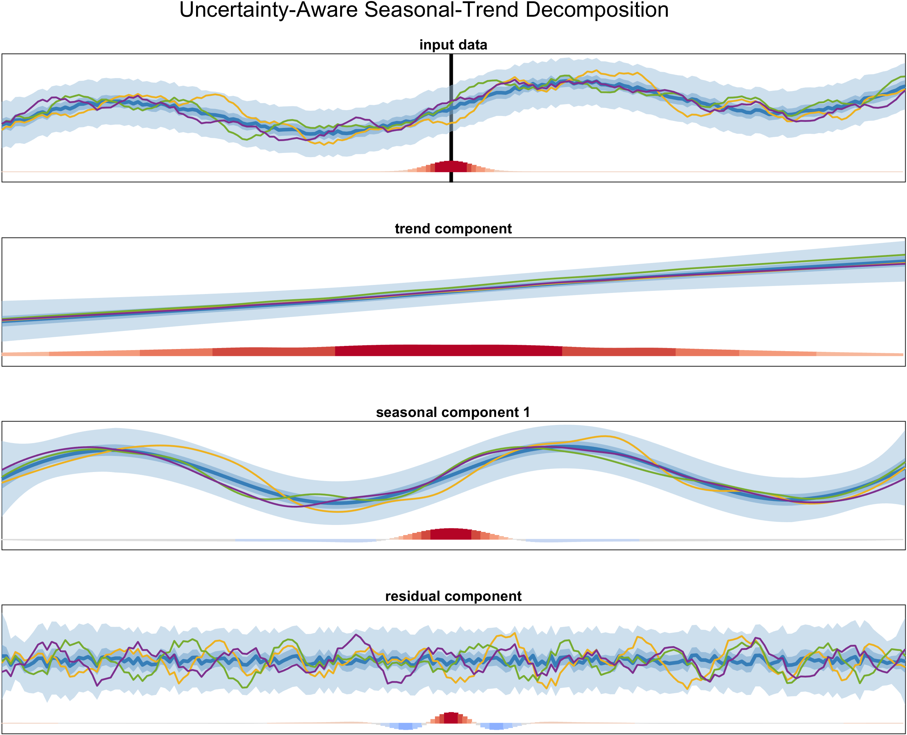
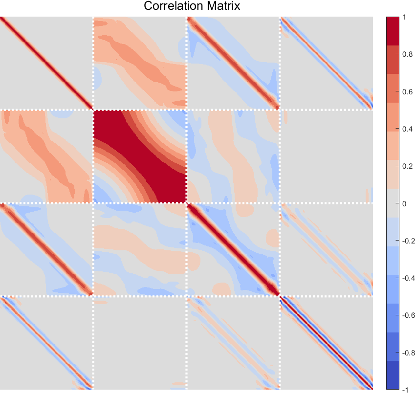
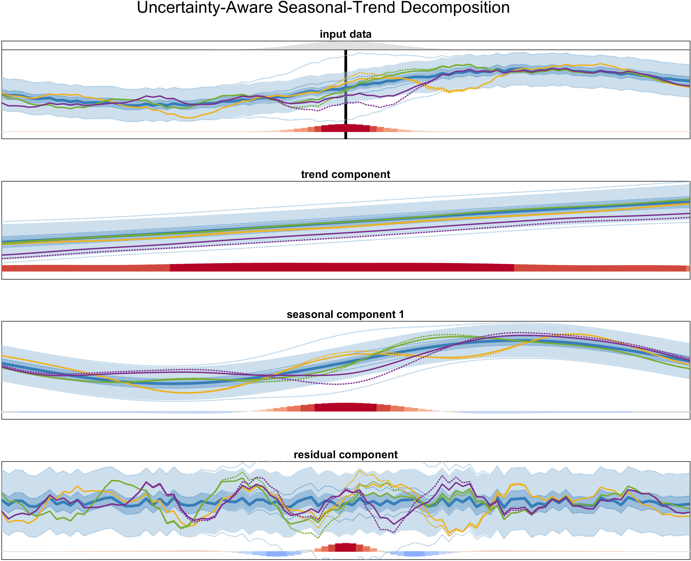

<h1 align="center">Uncertainty-Aware Seasonal-Trend Decomposition based on Loess</h1>


## ✨ Overview
This repository provides the code for **Uncertainty-Aware Seasonal-Trend Decomposition Based on Loess** (UASTL) by Krake et al. [[1]](#1). It describes the main method and additional visualization techniques.

The content is as follows: 

    │
    ├── figures   
    │   └── fig_1.png               # Example figure for UASTL and correlation exploration
    │   └── fig_1_cor.png           # Example figure for respective correlation matrix
    │   └── fig_2.png               # Example figure for UASTL and sensitivity analysis
    ├── VIS    
    │   ├── plot_distributionmtx.m  # Main visualization techniques
    │   ├── plot_dist.m             # Helper
    │   └── ...
    ├── loessmtx.m                  # Computation of loess matrix
    ├── uastl.m                     # Core of UASTL
    └── main_demo.m                 # Main demo for UASTL


## ⚙️ Usage
This code was tested with MATLAB2023b.

Main functionality can be accessed via the function `uastl`:

```Matlab
Xhat = UASTL(X,p,opts)
```
This function `uastl` implements the method **Uncertainty-Aware Seasonal-Trend Decomposition Based on Loess**. The method is described in more detail in the related publication [[1]](#1). For a (discrete) Gaussian process `X` and periods `p`, this function computes an uncertainty-aware seasonal-trend decomposition that consists of trend, seasonal, and residual components. The global Gaussian distributed variable `Xhat` contains these components and the data as well as the associated global covariance matrix.

A demo of UASTL is presented in `main_demo.m`, where a simple (discrete) Gaussian process with moderate uncertainty is analyzed. The results are as follows: 








## 📖 References
<a id="1">[1]</a> 
T. Krake, D. Klötzl, D. Hägele, and D. Weiskopf,
"Uncertainty-Aware Seasonal-Trend Decomposition Based on Loess",
In: currently under review. 


## 👤 Authors
**Tim Krake** and **Daniel Klötzl** and **David Hägele**

- Github: [@kraketm](https://github.com/kraketm)
- Github: [@visdan93](https://github.com/visdan93)
- Github: [@hageldave](https://github.com/hageldave)


## License
Copyright 2024 Tim Krake & Daniel Klötzl & David Hägele

Licensed under the Apache License, Version 2.0 (the "License");
you may not use this file except in compliance with the License.
You may obtain a copy of the License at

   http://www.apache.org/licenses/LICENSE-2.0

Unless required by applicable law or agreed to in writing, software
distributed under the License is distributed on an "AS IS" BASIS,
WITHOUT WARRANTIES OR CONDITIONS OF ANY KIND, either express or implied.
See the License for the specific language governing permissions and
limitations under the License.
